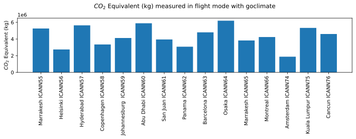
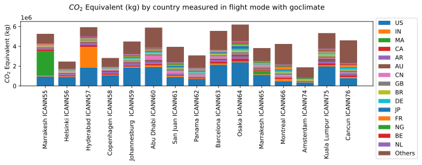

# ICANN Data

  <html>
  
  <body>
    <table style="width:100%">
          <tr>
<td><a href='https://mglt.github.io/co2eq/' style='font-size: 30px; text-decoration: none' >⌂</a></td>
<td><a href='https://mglt.github.io/co2eq/ICANN/ICANN'>ICANN</a></td>
<td><a href='https://mglt.github.io/co2eq/ICANN/ICANN55'>ICANN55</a></td>
<td><a href='https://mglt.github.io/co2eq/ICANN/ICANN56'>ICANN56</a></td>
<td><a href='https://mglt.github.io/co2eq/ICANN/ICANN57'>ICANN57</a></td>
<td><a href='https://mglt.github.io/co2eq/ICANN/ICANN58'>ICANN58</a></td>
<td><a href='https://mglt.github.io/co2eq/ICANN/ICANN59'>ICANN59</a></td>
      </tr>
      <tr>
<td><a href='https://mglt.github.io/co2eq/ICANN/ICANN60'>ICANN60</a></td>
<td><a href='https://mglt.github.io/co2eq/ICANN/ICANN61'>ICANN61</a></td>
<td><a href='https://mglt.github.io/co2eq/ICANN/ICANN62'>ICANN62</a></td>
<td><a href='https://mglt.github.io/co2eq/ICANN/ICANN63'>ICANN63</a></td>
<td><a href='https://mglt.github.io/co2eq/ICANN/ICANN64'>ICANN64</a></td>
<td><a href='https://mglt.github.io/co2eq/ICANN/ICANN65'>ICANN65</a></td>
<td><a href='https://mglt.github.io/co2eq/ICANN/ICANN66'>ICANN66</a></td>
      </tr>
      <tr>
<td><a href='https://mglt.github.io/co2eq/ICANN/ICANN74'>ICANN74</a></td>
<td><a href='https://mglt.github.io/co2eq/ICANN/ICANN75'>ICANN75</a></td>
<td><a href='https://mglt.github.io/co2eq/ICANN/ICANN76'>ICANN76</a></td>
<td> </td>
<td> </td>
<td> </td>
<td> </td>
      </tr>

    </table>
  </body>
  </html>
    
## I. CO2 Estimation in flight mode

### II.1 No Clustering for cabin ECONOMY

Resulting CO2eq per passenger per Km: 0.15947218233074179 kg/passenger/Km

Resulting CO2eq per passenger per Km: 0.20673572498886605 kg/passenger/Km

Resulting CO2eq per passenger per Km: 0.14369117073386298 kg/passenger/Km

### II.2 No Clustering for cabin AVERAGE

Resulting CO2eq per passenger per Km: 0.17642144231804463 kg/passenger/Km

Resulting CO2eq per passenger per Km: 0.2274602019790169 kg/passenger/Km

Resulting CO2eq per passenger per Km: 0.168278626266825 kg/passenger/Km

### II.3 Clustering by country for cabin ECONOMY

Resulting CO2eq per passenger per Km: 0.15947218233074179 kg/passenger/Km

Resulting CO2eq per passenger per Km: 0.20673572498886605 kg/passenger/Km

Resulting CO2eq per passenger per Km: 0.14369117073386298 kg/passenger/Km

### II.4 Clustering by country for cabin AVERAGE

Resulting CO2eq per passenger per Km: 0.17642144231804463 kg/passenger/Km

Resulting CO2eq per passenger per Km: 0.2274602019790169 kg/passenger/Km

Resulting CO2eq per passenger per Km: 0.168278626266825 kg/passenger/Km

### II.5 Clustering by subregion for cabin ECONOMY

Resulting CO2eq per passenger per Km: 0.15947218233074179 kg/passenger/Km

Resulting CO2eq per passenger per Km: 0.20673572498886605 kg/passenger/Km

Resulting CO2eq per passenger per Km: 0.14369117073386298 kg/passenger/Km

### II.6 Clustering by subregion for cabin AVERAGE

Resulting CO2eq per passenger per Km: 0.17642144231804463 kg/passenger/Km

Resulting CO2eq per passenger per Km: 0.2274602019790169 kg/passenger/Km

Resulting CO2eq per passenger per Km: 0.168278626266825 kg/passenger/Km

### II.7 Clustering by flight_segment_number for cabin ECONOMY

Resulting CO2eq per passenger per Km: 0.15947218233074179 kg/passenger/Km

Resulting CO2eq per passenger per Km: 0.20673572498886605 kg/passenger/Km

Resulting CO2eq per passenger per Km: 0.14369117073386298 kg/passenger/Km

### II.8 Clustering by flight_segment_number for cabin AVERAGE

Resulting CO2eq per passenger per Km: 0.17642144231804463 kg/passenger/Km

Resulting CO2eq per passenger per Km: 0.2274602019790169 kg/passenger/Km

Resulting CO2eq per passenger per Km: 0.168278626266825 kg/passenger/Km

## II. Number of Attendees

### III.9 No Clustering

### III.10 Clustering by country

### III.11 Clustering by subregion

### III.12 Clustering by flight_segment_number

