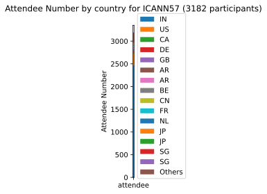

# ICANN57 Data

  <html>
  
  <body>
    <table style="width:100%">
          <tr>
<td><a href='https://mglt.github.io/co2eq/' style='font-size: 30px; text-decoration: none' >⌂</a></td>
<td><a href='https://mglt.github.io/co2eq/ICANN/ICANN'>ICANN</a></td>
<td><a href='https://mglt.github.io/co2eq/ICANN/ICANN55'>ICANN55</a></td>
<td><a href='https://mglt.github.io/co2eq/ICANN/ICANN56'>ICANN56</a></td>
<td><a href='https://mglt.github.io/co2eq/ICANN/ICANN57'>ICANN57</a></td>
<td><a href='https://mglt.github.io/co2eq/ICANN/ICANN58'>ICANN58</a></td>
<td><a href='https://mglt.github.io/co2eq/ICANN/ICANN59'>ICANN59</a></td>
      </tr>
      <tr>
<td><a href='https://mglt.github.io/co2eq/ICANN/ICANN60'>ICANN60</a></td>
<td><a href='https://mglt.github.io/co2eq/ICANN/ICANN61'>ICANN61</a></td>
<td><a href='https://mglt.github.io/co2eq/ICANN/ICANN62'>ICANN62</a></td>
<td><a href='https://mglt.github.io/co2eq/ICANN/ICANN63'>ICANN63</a></td>
<td><a href='https://mglt.github.io/co2eq/ICANN/ICANN64'>ICANN64</a></td>
<td><a href='https://mglt.github.io/co2eq/ICANN/ICANN65'>ICANN65</a></td>
<td><a href='https://mglt.github.io/co2eq/ICANN/ICANN66'>ICANN66</a></td>
      </tr>

    </table>
  </body>
  </html>
    

## CO2 Estimation in flight mode

### No Clustering

### Clustering by  flight segment number

### Clustering by  country

## CO2 Estimation in distance mode

### No Clustering

### Clustering by  flight segment number

### Clustering by  country

## Number of Attendees

### No Clustering

### Clustering by  flight segment number

### Clustering by  country

