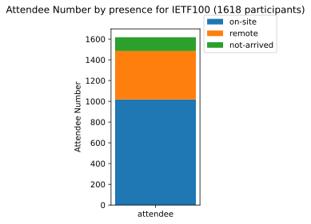
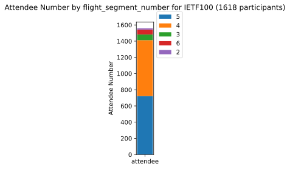

# IETF100 Data

  <html>
  
  <body>
    <table style="width:100%">
          <tr>
<td><a href='https://mglt.github.io/co2eq/' style='font-size: 30px; text-decoration: none' >⌂</a></td>
<td><a href='https://mglt.github.io/co2eq/IETF/IETF'>IETF</a></td>
<td><a href='https://mglt.github.io/co2eq/IETF/IETF72'>IETF72</a></td>
<td><a href='https://mglt.github.io/co2eq/IETF/IETF73'>IETF73</a></td>
<td><a href='https://mglt.github.io/co2eq/IETF/IETF74'>IETF74</a></td>
<td><a href='https://mglt.github.io/co2eq/IETF/IETF75'>IETF75</a></td>
<td><a href='https://mglt.github.io/co2eq/IETF/IETF76'>IETF76</a></td>
      </tr>
      <tr>
<td><a href='https://mglt.github.io/co2eq/IETF/IETF77'>IETF77</a></td>
<td><a href='https://mglt.github.io/co2eq/IETF/IETF78'>IETF78</a></td>
<td><a href='https://mglt.github.io/co2eq/IETF/IETF79'>IETF79</a></td>
<td><a href='https://mglt.github.io/co2eq/IETF/IETF80'>IETF80</a></td>
<td><a href='https://mglt.github.io/co2eq/IETF/IETF81'>IETF81</a></td>
<td><a href='https://mglt.github.io/co2eq/IETF/IETF82'>IETF82</a></td>
<td><a href='https://mglt.github.io/co2eq/IETF/IETF83'>IETF83</a></td>
      </tr>
      <tr>
<td><a href='https://mglt.github.io/co2eq/IETF/IETF84'>IETF84</a></td>
<td><a href='https://mglt.github.io/co2eq/IETF/IETF85'>IETF85</a></td>
<td><a href='https://mglt.github.io/co2eq/IETF/IETF86'>IETF86</a></td>
<td><a href='https://mglt.github.io/co2eq/IETF/IETF88'>IETF88</a></td>
<td><a href='https://mglt.github.io/co2eq/IETF/IETF89'>IETF89</a></td>
<td><a href='https://mglt.github.io/co2eq/IETF/IETF90'>IETF90</a></td>
<td><a href='https://mglt.github.io/co2eq/IETF/IETF91'>IETF91</a></td>
      </tr>
      <tr>
<td><a href='https://mglt.github.io/co2eq/IETF/IETF92'>IETF92</a></td>
<td><a href='https://mglt.github.io/co2eq/IETF/IETF93'>IETF93</a></td>
<td><a href='https://mglt.github.io/co2eq/IETF/IETF94'>IETF94</a></td>
<td><a href='https://mglt.github.io/co2eq/IETF/IETF95'>IETF95</a></td>
<td><a href='https://mglt.github.io/co2eq/IETF/IETF96'>IETF96</a></td>
<td><a href='https://mglt.github.io/co2eq/IETF/IETF97'>IETF97</a></td>
<td><a href='https://mglt.github.io/co2eq/IETF/IETF98'>IETF98</a></td>
      </tr>
      <tr>
<td><a href='https://mglt.github.io/co2eq/IETF/IETF99'>IETF99</a></td>
<td><a href='https://mglt.github.io/co2eq/IETF/IETF100'>IETF100</a></td>
<td><a href='https://mglt.github.io/co2eq/IETF/IETF101'>IETF101</a></td>
<td><a href='https://mglt.github.io/co2eq/IETF/IETF102'>IETF102</a></td>
<td><a href='https://mglt.github.io/co2eq/IETF/IETF103'>IETF103</a></td>
<td><a href='https://mglt.github.io/co2eq/IETF/IETF104'>IETF104</a></td>
<td><a href='https://mglt.github.io/co2eq/IETF/IETF105'>IETF105</a></td>
      </tr>
      <tr>
<td><a href='https://mglt.github.io/co2eq/IETF/IETF106'>IETF106</a></td>
<td><a href='https://mglt.github.io/co2eq/IETF/IETF107'>IETF107</a></td>
<td><a href='https://mglt.github.io/co2eq/IETF/IETF108'>IETF108</a></td>
<td><a href='https://mglt.github.io/co2eq/IETF/IETF109'>IETF109</a></td>
<td><a href='https://mglt.github.io/co2eq/IETF/IETF110'>IETF110</a></td>
<td><a href='https://mglt.github.io/co2eq/IETF/IETF111'>IETF111</a></td>
<td><a href='https://mglt.github.io/co2eq/IETF/IETF112'>IETF112</a></td>
      </tr>
      <tr>
<td><a href='https://mglt.github.io/co2eq/IETF/IETF113'>IETF113</a></td>
<td><a href='https://mglt.github.io/co2eq/IETF/IETF114'>IETF114</a></td>
<td><a href='https://mglt.github.io/co2eq/IETF/IETF115'>IETF115</a></td>
<td><a href='https://mglt.github.io/co2eq/IETF/IETF116'>IETF116</a></td>
<td> </td>
<td> </td>
<td> </td>
      </tr>

    </table>
  </body>
  </html>
    
## I. CO2 Estimation in flight mode

### II.1 No Clustering for cabin ECONOMY

Resulting CO2eq per passenger per Km: 0.1535230046836097 kg/passenger/Km

### II.2 Clustering by presence for cabin ECONOMY

Resulting CO2eq per passenger per Km: 0.1535230046836097 kg/passenger/Km

### II.3 Clustering by organization for cabin ECONOMY

Resulting CO2eq per passenger per Km: 0.1535230046836097 kg/passenger/Km

### II.4 Clustering by country for cabin ECONOMY

Resulting CO2eq per passenger per Km: 0.1535230046836097 kg/passenger/Km

### II.5 Clustering by subregion for cabin ECONOMY

Resulting CO2eq per passenger per Km: 0.1535230046836097 kg/passenger/Km

### II.6 Clustering by flight_segment_number for cabin ECONOMY

Resulting CO2eq per passenger per Km: 0.1535230046836097 kg/passenger/Km

## II. Number of Attendees

### III.7 No Clustering

### III.8 Clustering by presence

### III.9 Clustering by organization

### III.10 Clustering by country

### III.11 Clustering by subregion

### III.12 Clustering by flight_segment_number

