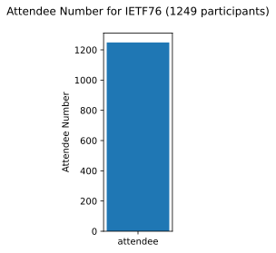
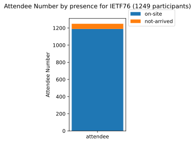
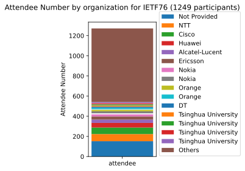

# IETF76 Data

  <html>
  
  <body>
    <table style="width:100%">
          <tr>
<td><a href='http://127.0.0.1:4000/' style='font-size: 30px; text-decoration: none' >⌂</a></td>
<td><a href='http://127.0.0.1:4000/IETF/IETF'>IETF</a></td>
<td><a href='http://127.0.0.1:4000/IETF/IETF72'>IETF72</a></td>
<td><a href='http://127.0.0.1:4000/IETF/IETF73'>IETF73</a></td>
<td><a href='http://127.0.0.1:4000/IETF/IETF74'>IETF74</a></td>
<td><a href='http://127.0.0.1:4000/IETF/IETF75'>IETF75</a></td>
<td><a href='http://127.0.0.1:4000/IETF/IETF76'>IETF76</a></td>
<td><a href='http://127.0.0.1:4000/IETF/IETF77'>IETF77</a></td>
<td><a href='http://127.0.0.1:4000/IETF/IETF78'>IETF78</a></td>
<td><a href='http://127.0.0.1:4000/IETF/IETF79'>IETF79</a></td>
      </tr>
      <tr>
<td><a href='http://127.0.0.1:4000/IETF/IETF80'>IETF80</a></td>
<td><a href='http://127.0.0.1:4000/IETF/IETF81'>IETF81</a></td>
<td><a href='http://127.0.0.1:4000/IETF/IETF82'>IETF82</a></td>
<td><a href='http://127.0.0.1:4000/IETF/IETF83'>IETF83</a></td>
<td><a href='http://127.0.0.1:4000/IETF/IETF84'>IETF84</a></td>
<td><a href='http://127.0.0.1:4000/IETF/IETF85'>IETF85</a></td>
<td><a href='http://127.0.0.1:4000/IETF/IETF86'>IETF86</a></td>
<td><a href='http://127.0.0.1:4000/IETF/IETF87'>IETF87</a></td>
<td><a href='http://127.0.0.1:4000/IETF/IETF88'>IETF88</a></td>
<td><a href='http://127.0.0.1:4000/IETF/IETF89'>IETF89</a></td>
      </tr>
      <tr>
<td><a href='http://127.0.0.1:4000/IETF/IETF90'>IETF90</a></td>
<td><a href='http://127.0.0.1:4000/IETF/IETF91'>IETF91</a></td>
<td><a href='http://127.0.0.1:4000/IETF/IETF92'>IETF92</a></td>
<td><a href='http://127.0.0.1:4000/IETF/IETF93'>IETF93</a></td>
<td><a href='http://127.0.0.1:4000/IETF/IETF94'>IETF94</a></td>
<td><a href='http://127.0.0.1:4000/IETF/IETF95'>IETF95</a></td>
<td><a href='http://127.0.0.1:4000/IETF/IETF96'>IETF96</a></td>
<td><a href='http://127.0.0.1:4000/IETF/IETF97'>IETF97</a></td>
<td><a href='http://127.0.0.1:4000/IETF/IETF98'>IETF98</a></td>
<td><a href='http://127.0.0.1:4000/IETF/IETF99'>IETF99</a></td>
      </tr>
      <tr>
<td><a href='http://127.0.0.1:4000/IETF/IETF100'>IETF100</a></td>
<td><a href='http://127.0.0.1:4000/IETF/IETF101'>IETF101</a></td>
<td><a href='http://127.0.0.1:4000/IETF/IETF102'>IETF102</a></td>
<td><a href='http://127.0.0.1:4000/IETF/IETF103'>IETF103</a></td>
<td><a href='http://127.0.0.1:4000/IETF/IETF104'>IETF104</a></td>
<td><a href='http://127.0.0.1:4000/IETF/IETF105'>IETF105</a></td>
<td><a href='http://127.0.0.1:4000/IETF/IETF106'>IETF106</a></td>
<td><a href='http://127.0.0.1:4000/IETF/IETF107'>IETF107</a></td>
<td><a href='http://127.0.0.1:4000/IETF/IETF108'>IETF108</a></td>
<td><a href='http://127.0.0.1:4000/IETF/IETF109'>IETF109</a></td>
      </tr>
      <tr>
<td><a href='http://127.0.0.1:4000/IETF/IETF110'>IETF110</a></td>
<td><a href='http://127.0.0.1:4000/IETF/IETF111'>IETF111</a></td>
<td><a href='http://127.0.0.1:4000/IETF/IETF112'>IETF112</a></td>
<td><a href='http://127.0.0.1:4000/IETF/IETF113'>IETF113</a></td>
<td><a href='http://127.0.0.1:4000/IETF/IETF114'>IETF114</a></td>
<td> </td>
<td> </td>
<td> </td>
<td> </td>
<td> </td>
      </tr>

    </table>
  </body>
  </html>
    

## CO2 Estimation in flight mode

### No Clustering

### Clustering by  presence

### Clustering by  flight segment number

### Clustering by  organization

### Clustering by  subregion

### Clustering by  country

## Number of Attendees

### No Clustering

### Clustering by  presence

### Clustering by  flight segment number

### Clustering by  organization

### Clustering by  subregion

### Clustering by  country

