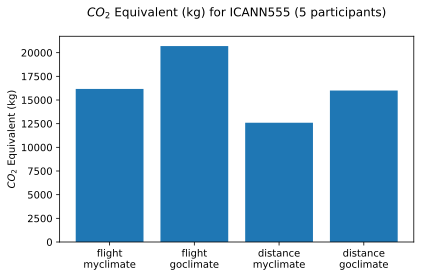
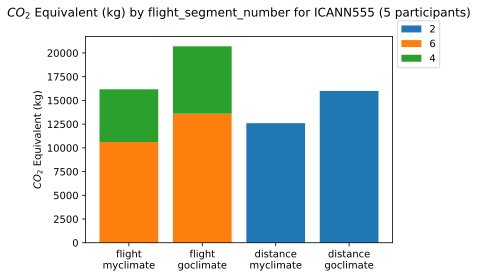

# ICANN555 Data

  <html>
  
  <body>
    <table style="width:100%">
          <tr>
<td><a href='https://mglt.github.io/co2eq/' style='font-size: 30px; text-decoration: none' >⌂</a></td>
<td><a href='https://mglt.github.io/co2eq/ICANN/ICANN'>ICANN</a></td>
<td><a href='https://mglt.github.io/co2eq/ICANN/ICANN555'>ICANN555</a></td>
<td> </td>
<td> </td>
<td> </td>
<td> </td>
      </tr>

    </table>
  </body>
  </html>
    

## CO2 Estimation in flight mode

### No Clustering

### Clustering by  flight segment number

